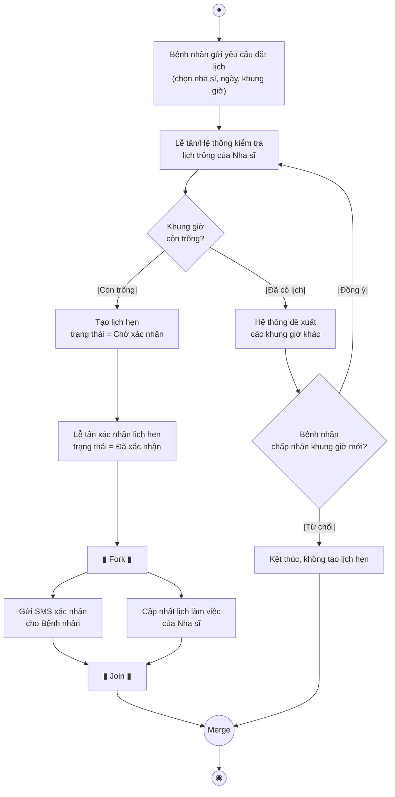
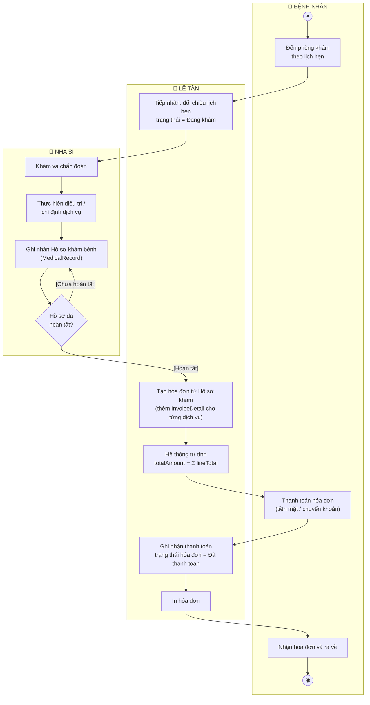
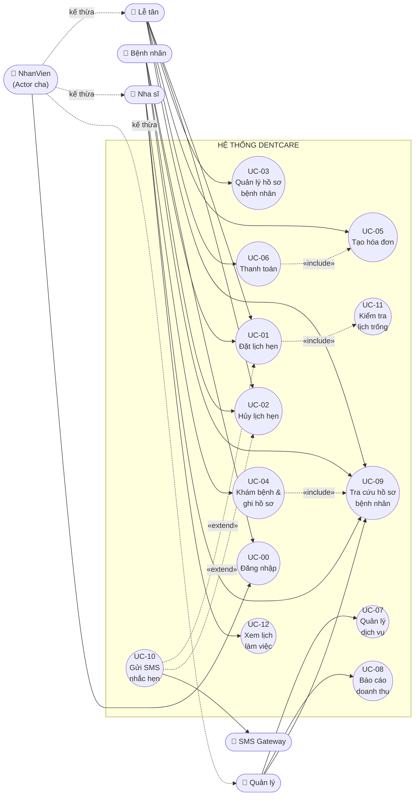

# Phần II – Mô hình hóa quy trình (Activity Diagram & Use Case Diagram)

## 2.1. Activity Diagram – Luồng **Đặt lịch hẹn**

Sử dụng **Initial Node, Decision Node, Merge Node, Fork/Join, Activity Final Node**.

**Ghi chú ký pháp:**
- `Decision Node` (hình thoi): `Khung giờ còn trống?`, `Bệnh nhân chấp nhận khung giờ mới?` – mỗi nhánh có **guard condition** đặt trong `[ ]`.
- `Fork/Join` (thanh ngang đậm): hai hành động **Gửi SMS xác nhận** và **Cập nhật lịch làm việc của Nha sĩ** chạy **song song** sau khi lịch được xác nhận, rồi đồng bộ lại tại Join.
- `Merge Node`: gộp hai luồng (thành công / từ chối) trước khi kết thúc.

> Mã PlantUML chuẩn: [`diagrams/puml/activity-dat-lich-hen.puml`](../diagrams/puml/activity-dat-lich-hen.puml)

---

## 2.2. Activity Diagram – Luồng **Khám bệnh và Thanh toán** (có Swimlane)

Ba Swimlane: **Bệnh nhân | Nha sĩ | Lễ tân**.

**Ghi chú:**
- Mỗi Swimlane thể hiện **trách nhiệm** của một vai trò; hành động nằm trong làn nào là do vai trò đó thực hiện.
- Ràng buộc nghiệp vụ được thể hiện bằng Decision Node `Hồ sơ đã hoàn tất?`: **hóa đơn chỉ được tạo sau khi Nha sĩ hoàn tất ghi nhận MedicalRecord**.

> Mã PlantUML chuẩn: [`diagrams/puml/activity-kham-benh-thanh-toan.puml`](../diagrams/puml/activity-kham-benh-thanh-toan.puml)

---

## 2.3. Use Case Diagram tổng thể

> Trong Mermaid, mũi tên `«extend»` được vẽ từ **Use Case mở rộng → Use Case cơ sở** đúng chiều chuẩn UML. Xem bản PlantUML đúng ký pháp hình elip: [`diagrams/puml/usecase-tong-the.puml`](../diagrams/puml/usecase-tong-the.puml)

### Giải thích quan hệ

| Quan hệ | Ví dụ | Ý nghĩa |
|---|---|---|
| **«include»** | `Thanh toán` include `Tạo hóa đơn` | Bắt buộc: không thể thanh toán nếu chưa có hóa đơn |
| **«include»** | `Đặt lịch hẹn` include `Kiểm tra lịch trống` | Bắt buộc: mọi lần đặt lịch đều phải kiểm tra trùng |
| **«include»** | `Khám bệnh & ghi hồ sơ` include `Tra cứu hồ sơ bệnh nhân` | Nha sĩ luôn phải xem bệnh sử trước khi ghi hồ sơ mới |
| **«extend»** | `Gửi SMS nhắc hẹn` extend `Đặt lịch hẹn` | Tùy chọn: chỉ xảy ra khi bệnh nhân đăng ký nhận SMS |
| **«extend»** | `Gửi SMS nhắc hẹn` extend `Hủy lịch hẹn` | Tùy chọn: thông báo cho Nha sĩ khi lịch bị hủy |
| **Generalization (Actor)** | `NhanVien` là cha của `Lễ tân`, `Nha sĩ`, `Quản lý` | Cả ba đều là nhân viên nội bộ, kế thừa use case chung `Đăng nhập`, `Tra cứu hồ sơ bệnh nhân` |
| **Actor phụ (Secondary Actor)** | `SMS Gateway` | Hệ thống bên ngoài nhận yêu cầu gửi tin nhắn |

---

## 2.4. Đặc tả Use Case: **UC-01 – Đặt lịch hẹn**

| Mục | Nội dung |
|---|---|
| **Mã Use Case** | UC-01 |
| **Tên Use Case** | Đặt lịch hẹn |
| **Actor chính** | Bệnh nhân (hoặc Lễ tân đặt hộ) |
| **Actor phụ** | SMS Gateway |
| **Mô tả** | Cho phép Bệnh nhân (hoặc Lễ tân) chọn nha sĩ, ngày và khung giờ còn trống để tạo một lịch hẹn khám. Hệ thống kiểm tra trùng lịch trước khi ghi nhận. |
| **Mức độ ưu tiên** | Cao |
| **Tần suất** | Rất thường xuyên (hàng chục lượt/ngày) |
| **Tiền điều kiện** | 1. Actor đã đăng nhập hệ thống với vai trò Bệnh nhân hoặc Lễ tân. 2. Bệnh nhân đã có hồ sơ trong hệ thống (patientId hợp lệ). 3. Danh mục nha sĩ và khung giờ làm việc đã được thiết lập. |
| **Hậu điều kiện (Thành công)** | 1. Một bản ghi `Appointment` mới được lưu với trạng thái "Chờ xác nhận" (hoặc "Đã xác nhận" nếu Lễ tân đặt trực tiếp). 2. Khung giờ đó của nha sĩ bị khóa, không cho đặt trùng. 3. Lịch làm việc của Nha sĩ được cập nhật. 4. SMS xác nhận được gửi (nếu bệnh nhân đăng ký nhận SMS). |
| **Hậu điều kiện (Thất bại)** | Không có lịch hẹn nào được tạo; dữ liệu hệ thống không thay đổi. |

### Luồng chính (Main / Basic Flow)

| # | Actor | Hệ thống |
|---|---|---|
| 1 | Actor chọn chức năng **"Đặt lịch hẹn"** | |
| 2 | | Hệ thống hiển thị form: danh sách Nha sĩ, chọn ngày, danh sách khung giờ |
| 3 | Actor chọn Nha sĩ và ngày hẹn | |
| 4 | | Hệ thống **«include» UC-11 Kiểm tra lịch trống**: truy vấn các Appointment ở trạng thái "Đã xác nhận" của nha sĩ trong ngày đó và hiển thị các khung giờ còn trống |
| 5 | Actor chọn khung giờ trống, chọn dịch vụ dự kiến (tùy chọn), nhấn **"Xác nhận đặt lịch"** | |
| 6 | | Hệ thống kiểm tra hợp lệ: `ngayHen >= ngày hiện tại`, khung giờ chưa bị đặt |
| 7 | | Hệ thống tạo `Appointment` mới (sinh `appointmentId` duy nhất), trạng thái = "Chờ xác nhận", lưu vào CSDL |
| 8 | | Hệ thống hiển thị thông báo đặt lịch thành công kèm mã lịch hẹn; **«extend» UC-10** gửi SMS xác nhận/nhắc hẹn |
| 9 | Actor xem thông tin lịch hẹn | Use case kết thúc |

### Luồng thay thế (Alternative Flows)

**A1 – Khung giờ đã có người đặt (phát hiện ở bước 6, do tranh chấp đồng thời)**
- A1.1 Hệ thống thông báo: *"Khung giờ này vừa được đặt. Vui lòng chọn khung giờ khác."*
- A1.2 Hệ thống hiển thị danh sách khung giờ trống gần nhất (cùng ngày hoặc ngày kế tiếp) của nha sĩ.
- A1.3 Nếu Actor chọn khung giờ mới → quay lại bước 5 của luồng chính.
- A1.4 Nếu Actor từ chối → Use case kết thúc, không tạo lịch hẹn.

**A2 – Nha sĩ không có lịch làm việc trong ngày được chọn (bước 4)**
- A2.1 Hệ thống hiển thị *"Nha sĩ không làm việc vào ngày này"* và gợi ý ngày làm việc gần nhất.
- A2.2 Actor chọn lại ngày → quay về bước 4.

**A3 – Lễ tân đặt lịch cho bệnh nhân chưa có hồ sơ (bước 3)**
- A3.1 Lễ tân chọn **"Tạo hồ sơ mới"** → thực hiện **UC-03 Quản lý hồ sơ bệnh nhân**.
- A3.2 Sau khi tạo xong hồ sơ, quay về bước 3.

### Ngoại lệ (Exception Flows)

| Mã | Tình huống | Xử lý |
|---|---|---|
| E1 | Ngày hẹn nhỏ hơn ngày hiện tại | Hiển thị lỗi *"Ngày hẹn không được nhỏ hơn ngày hiện tại"*, giữ nguyên form |
| E2 | Mất kết nối CSDL khi lưu | Rollback giao dịch, hiển thị *"Hệ thống bận, vui lòng thử lại"*, không tạo lịch hẹn |
| E3 | SMS Gateway lỗi | Lịch hẹn **vẫn được lưu thành công**; hệ thống ghi log lỗi và đưa tin nhắn vào hàng đợi gửi lại |

### Ràng buộc nghiệp vụ liên quan
- **BR-01:** Mỗi `timeSlot` của một Nha sĩ trong một ngày chỉ được phép có **tối đa 1** lịch hẹn ở trạng thái "Đã xác nhận".
- **BR-03:** `ngayHen >= ngày hiện tại`.
- **BR-06:** `appointmentId` duy nhất trong toàn hệ thống.
