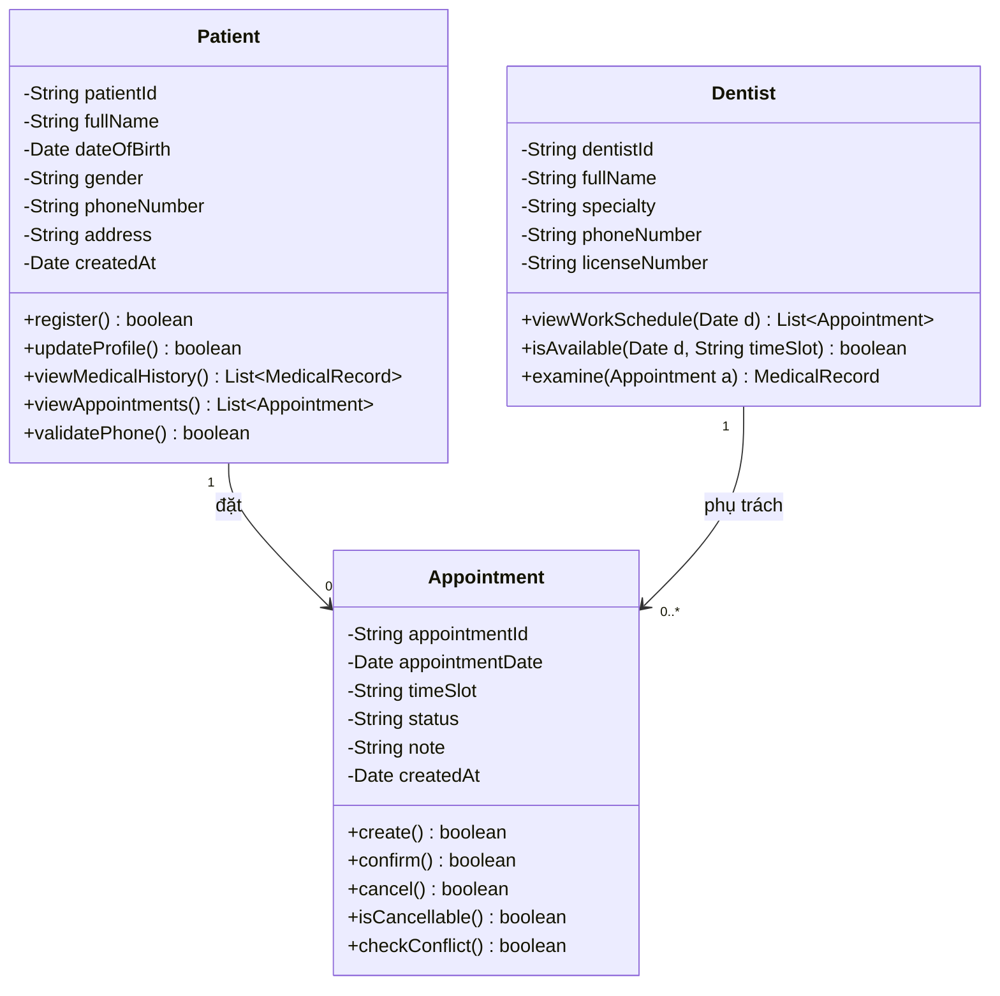
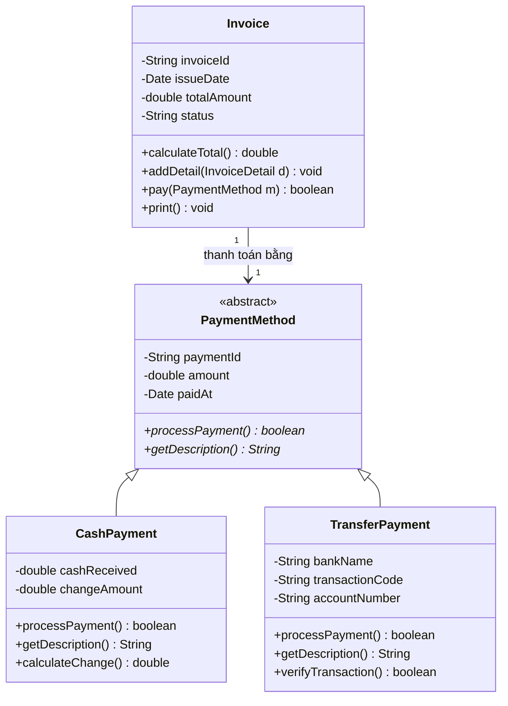
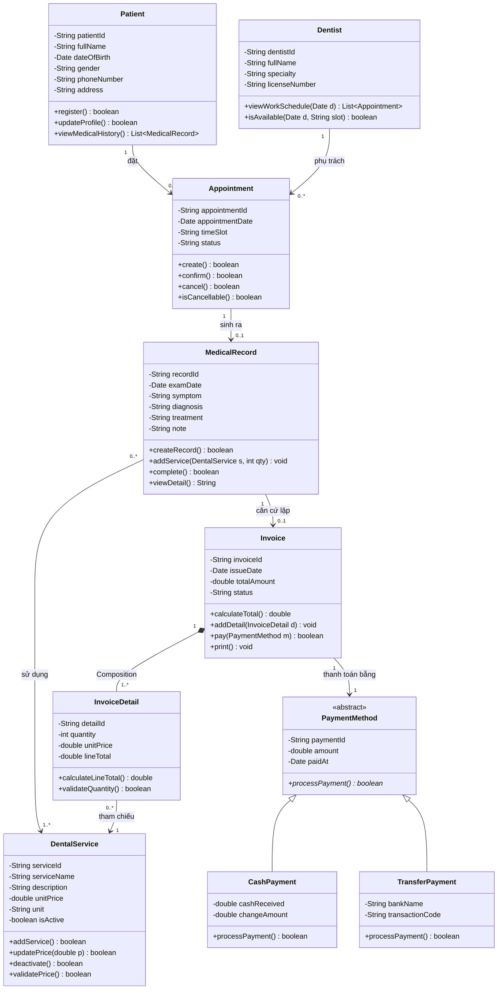

# Phần III – Thiết kế cấu trúc tĩnh (Class Diagram)

## 3.1. Class Diagram phân hệ **Bệnh nhân – Lịch hẹn**

**Giải thích Multiplicity:**
- `Patient (1) --- (0..*) Appointment`: một Bệnh nhân có thể có **0 hoặc nhiều** lịch hẹn; mỗi lịch hẹn thuộc về **đúng 1** Bệnh nhân.
- `Dentist (1) --- (0..*) Appointment`: một Nha sĩ phụ trách **0 hoặc nhiều** lịch hẹn; mỗi lịch hẹn do **đúng 1** Nha sĩ đảm nhận.
- `status` ∈ {Chờ xác nhận, Đã xác nhận, Đã khám, Đã hủy}.
- `isCancellable()` hiện thực ràng buộc **BR-02**: chỉ trả về `true` khi `status` là "Chờ xác nhận" hoặc "Đã xác nhận".

---

## 3.2. Class Diagram phân hệ **Thanh toán** (Generalization / Inheritance)

**Giải thích:**
- `PaymentMethod` là **lớp trừu tượng (abstract)**; `processPayment()` và `getDescription()` là phương thức trừu tượng được **override** ở lớp con → thể hiện **Generalization/Inheritance** và **Đa hình (Polymorphism)**.
- Quan hệ `Invoice (1) --- (1) PaymentMethod`: mỗi hóa đơn được thanh toán bằng **đúng một** phương thức.
- Nhờ kế thừa, khi bổ sung hình thức thanh toán mới (VD: `EWalletPayment`) chỉ cần thêm lớp con, **không sửa** lớp `Invoice` (tuân thủ NFR-07 / nguyên lý Open–Closed).

---

## 3.3. Class Diagram **tổng thể**

> Mã PlantUML chuẩn: [`diagrams/puml/class-tong-the.puml`](../diagrams/puml/class-tong-the.puml)

### Bảng tổng hợp quan hệ

| Quan hệ | Loại | Multiplicity | Diễn giải |
|---|---|---|---|
| Patient – Appointment | Association | 1 : 0..* | Một bệnh nhân có nhiều lịch hẹn |
| Dentist – Appointment | Association | 1 : 0..* | Một nha sĩ phụ trách nhiều lịch hẹn |
| Appointment – MedicalRecord | Association | 1 : 0..1 | Một lịch hẹn sinh ra tối đa một hồ sơ khám (lịch bị hủy thì không có) |
| MedicalRecord – Invoice | Association | 1 : 0..1 | Một hồ sơ khám là căn cứ lập tối đa một hóa đơn |
| MedicalRecord – DentalService | Association | 0..* : 1..* | Một lần khám dùng nhiều dịch vụ; một dịch vụ xuất hiện ở nhiều hồ sơ |
| **Invoice – InvoiceDetail** | **Composition ◆** | 1 : 1..* | Dòng chi tiết **không tồn tại độc lập**; xóa hóa đơn thì xóa toàn bộ dòng chi tiết |
| InvoiceDetail – DentalService | Association | 0..* : 1 | Mỗi dòng chi tiết tham chiếu đúng một dịch vụ |
| Invoice – PaymentMethod | Association | 1 : 1 | Mỗi hóa đơn có một phương thức thanh toán |
| PaymentMethod – CashPayment/TransferPayment | **Generalization ▷** | — | Kế thừa, đa hình |

### Cách các ràng buộc được thể hiện trong Class Diagram

| Ràng buộc | Thể hiện |
|---|---|
| Các mã (`patientId`, `dentistId`, `appointmentId`, `recordId`, `invoiceId`, `serviceId`) duy nhất toàn hệ thống | Mỗi lớp có thuộc tính khóa `{unique, id}`; ở CSDL là PRIMARY KEY + ràng buộc UNIQUE |
| Một `Appointment` thuộc đúng 1 `Patient` và đúng 1 `Dentist` | Multiplicity phía Patient và Dentist đều là **1** (bắt buộc, không phải 0..1) |
| Một `MedicalRecord` gắn đúng 1 `Appointment` | Multiplicity phía Appointment = **1** |
| Một `Invoice` gắn đúng 1 `MedicalRecord` | Multiplicity phía MedicalRecord = **1** |
| Xóa `Patient` **không** xóa `MedicalRecord` và `Invoice` | Quan hệ Patient–Appointment là **Association (không phải Composition)**; áp dụng **xóa mềm** (`isDeleted = true`) cho Patient, ràng buộc khóa ngoại `ON DELETE RESTRICT` để bảo toàn dữ liệu lịch sử |
| `totalAmount` = Σ `lineTotal` | Phương thức `Invoice.calculateTotal()` duyệt tập `InvoiceDetail` (quan hệ Composition) và cộng dồn |
| `quantity >= 1`, `unitPrice > 0` | `InvoiceDetail.validateQuantity()`, `DentalService.validatePrice()` |
