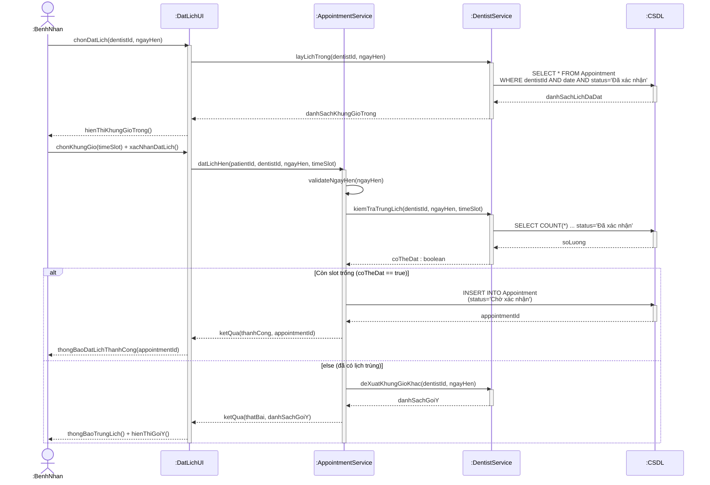
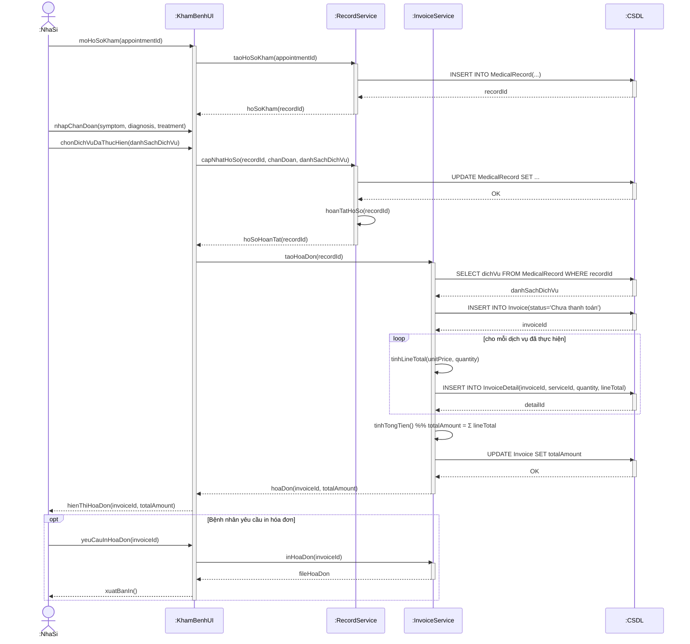
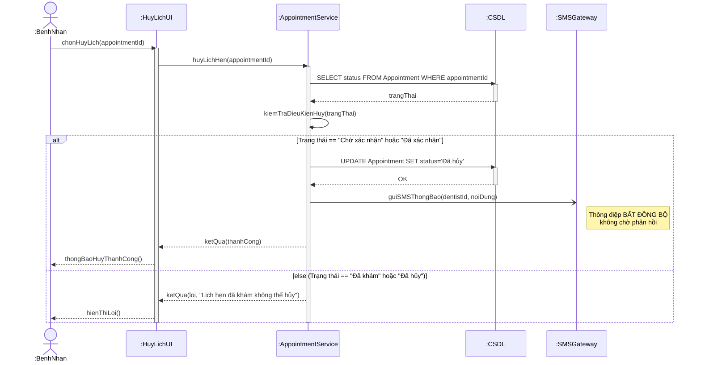

# Phần IV – Mô hình hóa tương tác (Sequence Diagram)

## 4.1. SD-01 – Luồng **Đặt lịch hẹn**

**Ký pháp đã sử dụng:**
- **Thông điệp đồng bộ** (mũi tên đặc `->>` + Activation Bar): `layLichTrong()`, `kiemTraTrungLich()` – bên gửi **chờ** kết quả trả về.
- **Return Message nét đứt** (`-->>`): `danhSachKhungGioTrong`, `coTheDat`, `appointmentId`.
- **Combined Fragment `alt`**: hai nhánh `[Còn slot trống]` / `[else]`.
- **Self Message**: `AS->>AS: validateNgayHen()` – đối tượng tự gọi phương thức của chính nó.

> PlantUML: [`diagrams/puml/sequence-dat-lich-hen.puml`](../diagrams/puml/sequence-dat-lich-hen.puml)

---

## 4.2. SD-02 – Luồng **Khám bệnh và Tạo hóa đơn**

**Ký pháp đã sử dụng:**
- **`loop [cho mỗi dịch vụ đã thực hiện]`**: thêm từng `InvoiceDetail`.
- **`opt [Bệnh nhân yêu cầu in hóa đơn]`**: nhánh tùy chọn.
- **Self Message `tinhTongTien()`**: `InvoiceService` tự tính `totalAmount = Σ lineTotal` (ràng buộc nghiệp vụ).
- **Thứ tự bắt buộc:** `taoHoaDon()` chỉ được gọi **sau** khi `hoanTatHoSo()` trả về thành công → hiện thực ràng buộc *"Hóa đơn chỉ được tạo sau khi Nha sĩ hoàn tất ghi nhận MedicalRecord"*.

> PlantUML: [`diagrams/puml/sequence-kham-benh-tao-hoadon.puml`](../diagrams/puml/sequence-kham-benh-tao-hoadon.puml)

---

## 4.3. SD-03 – Luồng **Hủy lịch hẹn**

**Ký pháp đã sử dụng:**
- **Thông điệp bất đồng bộ** (`-)`, mũi tên nét mảnh hở): `guiSMSThongBao()` gửi tới `:SMSGateway` – hệ thống **không chờ** kết quả, người dùng nhận phản hồi ngay.
- **`alt [Trạng thái == Chờ xác nhận / Đã xác nhận]` / `[else]`**: hiện thực ràng buộc **BR-02**.
- **Self Message** `kiemTraDieuKienHuy()`.
- **Return Message nét đứt** cho mọi giá trị trả về.

> PlantUML: [`diagrams/puml/sequence-huy-lich-hen.puml`](../diagrams/puml/sequence-huy-lich-hen.puml)
